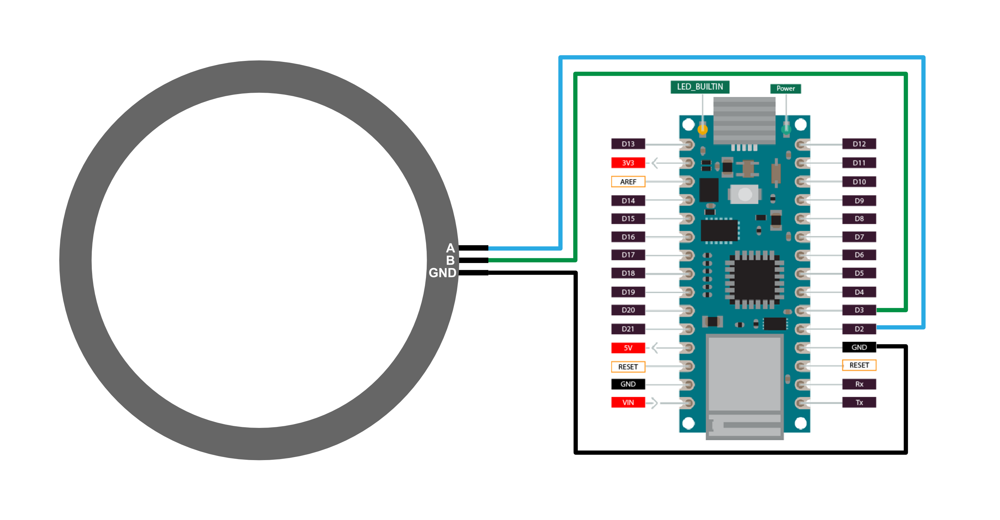

## Overview

This note provides technical data as well as sample code to work with _3 Pin Incremental encoders_. Other than _Potentiometers_, _Incremental Ring Encoders_ do not have an absolute output, that is achieved with a changing resistor. Instead, they use two rings with an array of holes inside them. If a hole is over the sensor on the other side, light can pass through and the sensor puts out a 1, if the sensor is blocked by the plate it puts out a 0.
Through the order in which 0s and 1s are detected from the two pins, it can be deducted if the encoder is turned clockwise or counterclockwise.

## Wiring

For the _PER561-P115-N0015_ the PinOut looks like this:

However, it might not be clear which pin is the ground-pin. To avoid confusion, it might help to use a _Multimeter_.
